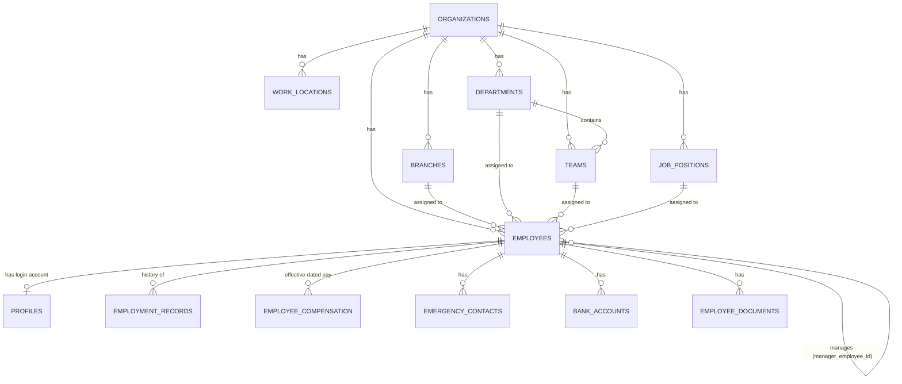
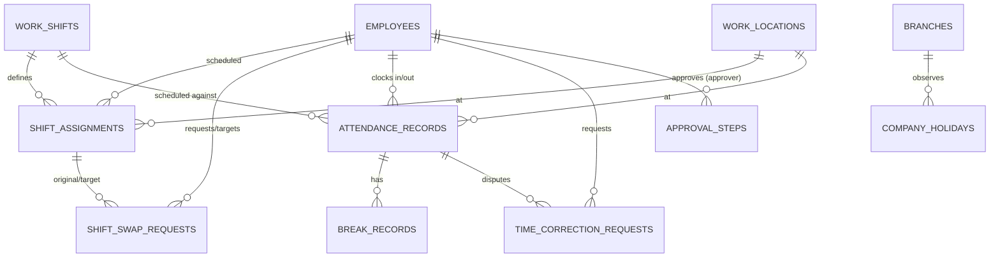
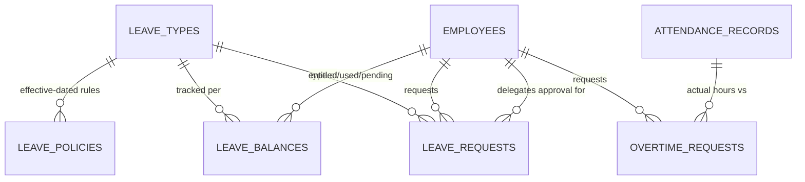
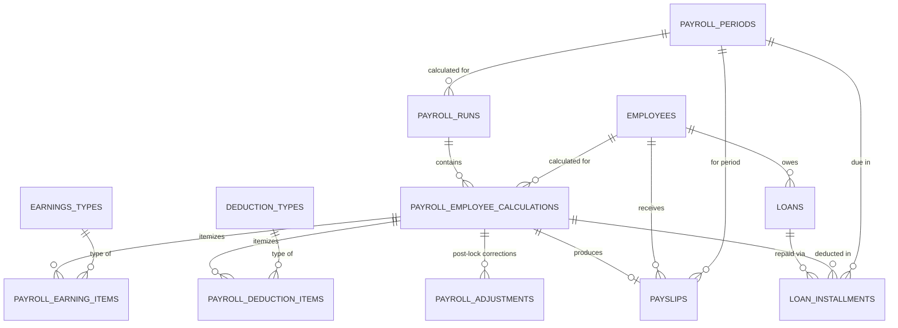
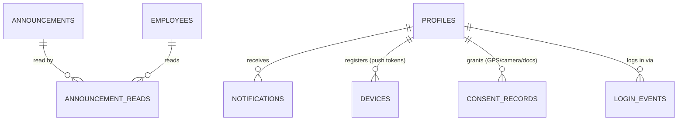
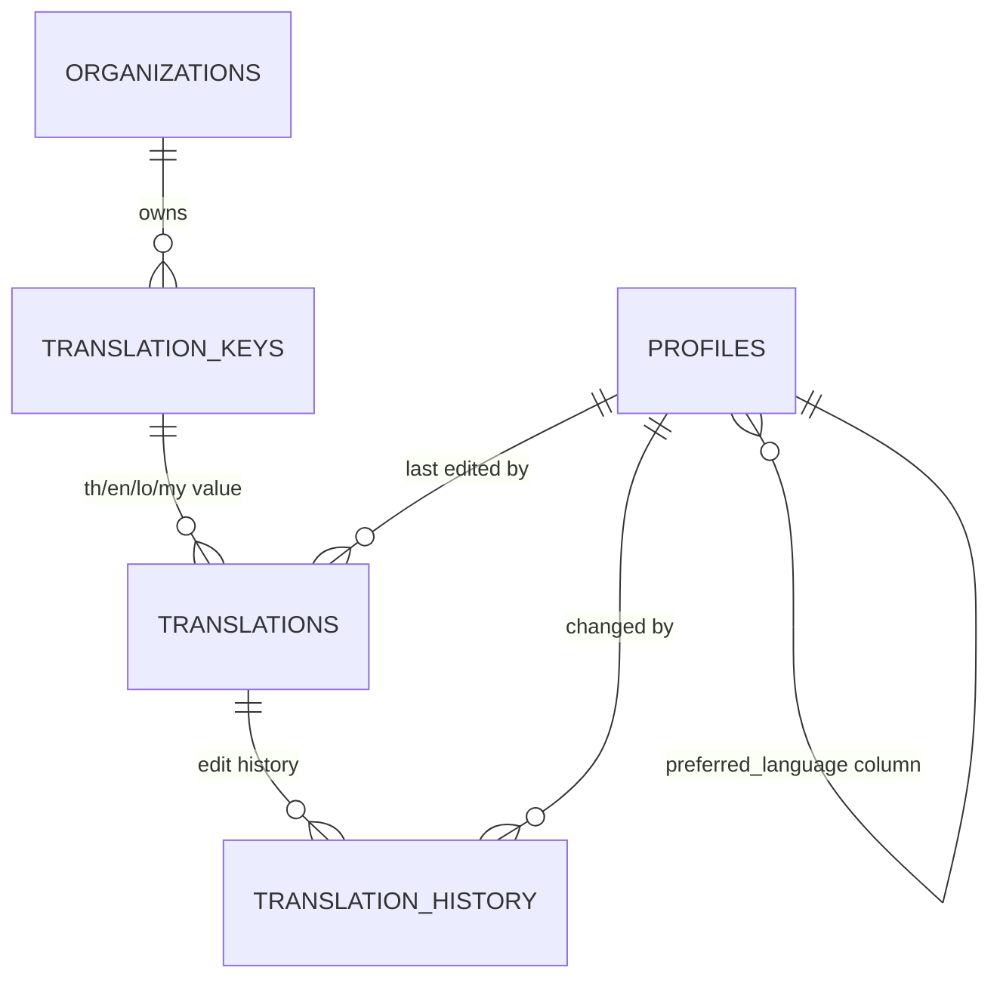
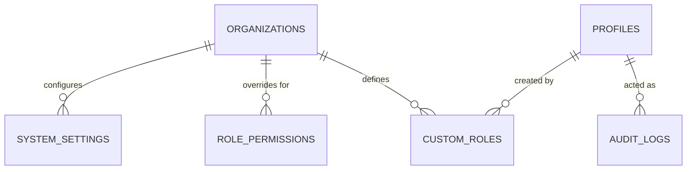

# ER Diagram — Nineall HR

Generated directly from the live schema (`supabase/migrations/0001`–`0016`,
all applied to the `nineall-hr` Supabase project, `zopfkyfqgvaxawlkuink`) —
not hand-drawn from memory. Split into domain diagrams because one 52-table
diagram is unreadable; `DATABASE_SCHEMA.md` has the prose walkthrough
(triggers, RLS, conventions) this file doesn't repeat.

Every table also has `org_id → organizations(id)` for multi-tenant scoping
except where it hangs off another org-scoped row instead (e.g.
`shift_assignments` doesn't need its own `org_id` check beyond `employees`).
That edge is omitted from each diagram below to keep them legible — assume
every table is org-scoped unless it's a pure join table.

## 1. Organization & People (`0002`)

`employees` (HR record) and `profiles` (1:1 with `auth.users`, holds `role` +
`preferred_language`) are deliberately separate — an employee can exist
before they have login credentials. `profiles.role` now includes
`payroll_admin` (added `0013`, master prompt §6's 5 roles).

## 2. Attendance & Shifts (`0003`)

`approval_steps` is polymorphic (`request_type` + `request_id`, no FK) —
it's the generic approval engine (master prompt §11) shared by leave, OT,
time-correction, shift-swap, and payroll-period sign-off. That's a
deliberate denormalization, not a missed foreign key.

## 3. Leave, Overtime & Approvals (`0004`)

`leave_balances` (entitled/carried-over/used/pending, per employee/type/year)
is maintained by DB triggers (`validate_and_reserve_leave_balance`,
`apply_leave_decision` — see `DATABASE_SCHEMA.md`), not application code, so
balance integrity survives even a direct-SQL edit.

## 4. Payroll & Loans (`0005`, `0014`)

`payroll_employee_calculations` is a **snapshot** — employee name/department/
position are copied in at calculation time so a later org-chart change
doesn't rewrite payroll history. `policy_settings` (versioned tax/SS/OT
config, not diagrammed here — it's a standalone effective-dated table with
no FK, see `PAYROLL_RULES.md`) is what makes formula changes not retroactive.

## 5. Announcements, Notifications, Files, Devices, Consent (`0006`, `0014`)

`uploaded_files` (generic file registry, org-scoped only) and
`system_settings` (org-scoped key/value) have no other FKs and aren't
diagrammed.

## 6. Translation Management (`0014` — new this session, see §8)

One `translations` row per `(translation_key_id, locale)`; a key with fewer
than 4 rows is a "missing translation" the admin-web Translation Management
screen surfaces (master prompt §5).

## 7. Settings, Permissions, Audit, Custom Roles (`0007`, `0014`)

## 8. Gap-fill migration rationale (`0014`)

Session-1 schema (`0001`–`0012`) covered the original master prompt closely
but missed a few things the *unified* master prompt
(`Claude_Master_Prompt_Nineall_HR_Web_Android_iOS.md`) makes explicit
requirements. `0014` was applied directly to the live project via the
Supabase MCP tools without a matching local file at the time — this file,
and `0013`–`0016` now existing under `supabase/migrations/`, closes that gap
so the repo matches the live database exactly (master prompt §18: "เขียน
Migration ทุกครั้ง ห้ามแก้ฐานข้อมูลด้วยมือแล้วไม่บันทึก").

| Table/column | Master prompt requirement it fills |
|---|---|
| `translation_keys`, `translations`, `translation_history`, `profiles.preferred_language` | §5 — 4-language system, missing-translation tracking, per-user language memory, edit history |
| `devices` | §15 — push notification device registry (can't send push without a token to send to) |
| `consent_records` | §19 — consent log for GPS/camera/document access |
| `loans`, `loan_installments` | §13 — "เงินกู้" / "เงินเบิกล่วงหน้า" payroll deduction lines need a source table and an installment schedule that payroll can deduct against |
| `custom_roles` | §6 — "Super Admin สามารถสร้าง Custom Role" — foundation table only; not yet wired into the actual permission check (see the table's migration comment) — tracked in `IMPLEMENTATION_STATUS.md` as not done, not silently assumed complete |
| `user_role` enum: `payroll_admin` | §6 — 5th role explicitly required, the original enum only had 4 |
| `approval_status` enum: `more_information_required` | §11 — one of the 6 required approval states, missing from the original enum |
| `lookup_login_email()` (`0016`) | §17 login screen — "Email / Employee ID" combined field needs a way to resolve an employee code to an email pre-auth, without exposing the `profiles`/`employees` tables to anonymous reads |
